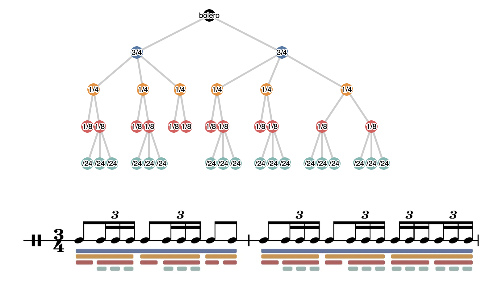
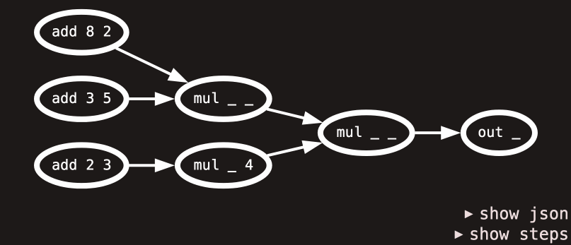
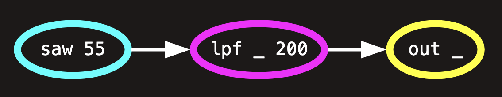
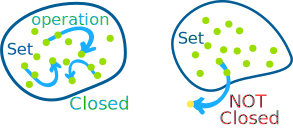
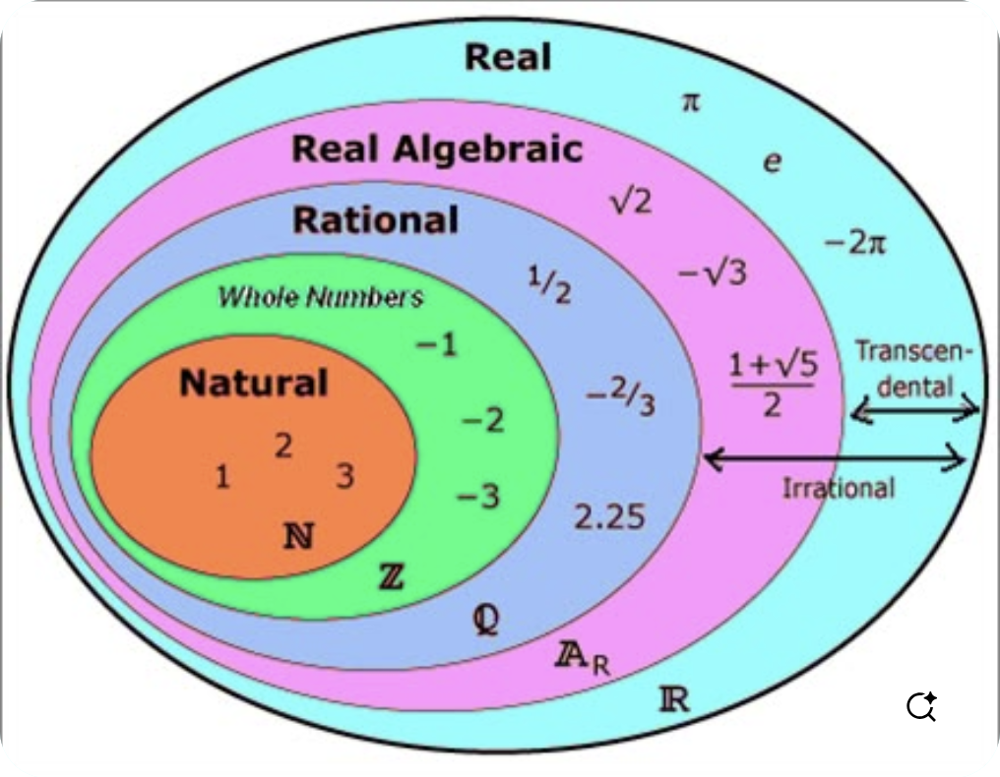
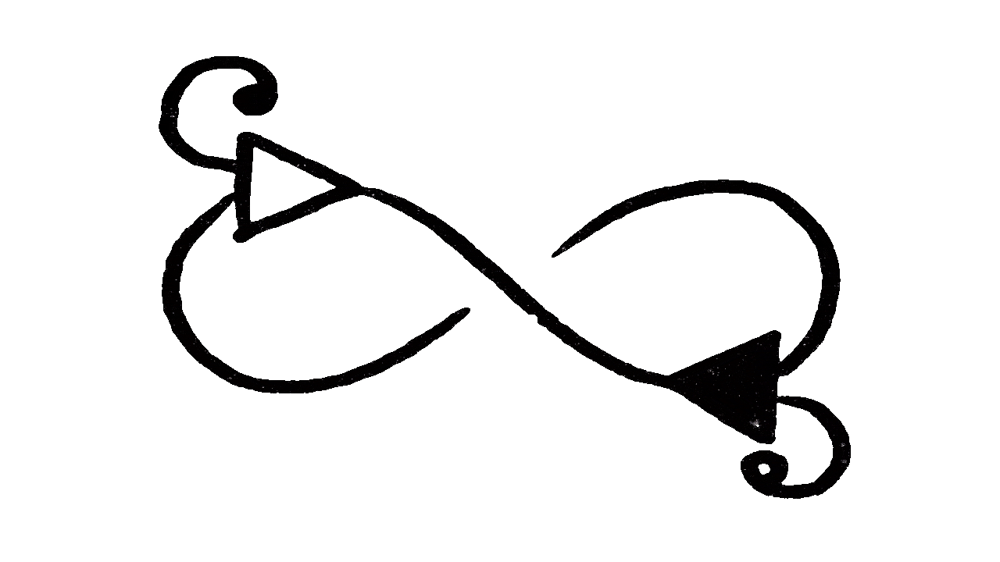

---
# You can also start simply with 'default'
theme: seriph
# random image from a curated Unsplash collection by Anthony
# like them? see https://unsplash.com/collections/94734566/slidev
# background: https://cover.sli.dev
# some information about your slides (markdown enabled)
title: tools for thought
info: dsl tools for thought
# apply unocss classes to the current slide
class: text-center
# https://sli.dev/features/drawing
drawings:
  persist: false
# slide transition: https://sli.dev/guide/animations.html#slide-transitions
transition: fade
# enable MDC Syntax: https://sli.dev/features/mdc
mdc: true
# open graph
# seoMeta:
#  ogImage: https://cover.sli.dev
---

# Domain Specific Thoughts

## Top 3 Domain Specific Language Properties for 2025

---

# whoami

Felix Roos - @froos@post.lurk.org

- web developer by trade
- former trumpet player, now derailed
- got into live coding ~4 years ago
- made a few live coding languages
  - strudel
  - kabelsalat
  - mondo notation
- i do this just for fun, no strings attached

---

# tools for thought

and how i use them in my own languages

1. ## isomorphism
2. ## recursion
3. ## closure

---

# Disclaimer

I am not an academic! I am not an mathematician! I am not a computer scientist!
I am not an academic! I am not an mathematician! I am not a computer scientist!
I am not an academic! I am not an mathematician! I am not a computer scientist!
I am not an academic! I am not an mathematician! I am not a computer scientist!
I am not an academic! I am not an mathematician! I am not a computer scientist!
I am not an academic! I am not an mathematician! I am not a computer scientist!
I am not an academic! I am not an mathematician! I am not a computer scientist!
I am not an academic! I am not an mathematician! I am not a computer scientist!
I am not an academic! I am not an mathematician! I am not a computer scientist!
I am not an academic! I am not an mathematician! I am not a computer scientist!
I am not an academic! I am not an mathematician! I am not a computer scientist!
I am not an academic! I am not an mathematician! I am not a computer scientist!
I am not an academic! I am not an mathematician! I am not a computer scientist!
I am not an academic! I am not an mathematician! I am not a computer scientist!
I am not an academic! I am not an mathematician! I am not a computer scientist!
I am not an academic! I am not an mathematician! I am not a computer scientist!
I am not an academic! I am not an mathematician! I am not a computer scientist!
I am not an academic! I am not an mathematician! I am not a computer scientist!
I am not an academic! I am not an mathematician! I am not a computer scientist!
I am not an academic! I am not an mathematician! I am not a computer scientist!
I am not an academic! I am not an mathematician! I am not a computer scientist!
I am not an academic! I am not an mathematician! I am not a computer scientist!
I am not an academic! I am not an mathematician! I am not a computer scientist!
I am not an academic! I am not an mathematician! I am not a computer scientist!

---

# 1. isomorphism

The word "isomorphism' applies when two complex structures can be mapped onto
each other, in such a way that to each part of one structure there is a
corresponding part in the other structure, where "corresponding" means that the
two parts play similar roles in their respective structures.

_Chapter II in Gödel, Escher, Bach_

### isomorphism = information preserving transformation

<!--
...
-->

---

# 1. isomorphism

bolero rhythm tree



<!--
- made this in 2021
- marks the start of my appreciation for trees
- the tree contains the same information as the score, using less visual encoding
- blue: vertical lines (should be 1/2 in the tree)
- yellow: space-separated groups
- red: upper beam
- cyan: lower beam
-->

---

# 1. isomorphism

bolero as json

````md magic-move {lines: false}
```json
// multiple layers
[
  [
    [1, [1, 1, 1]],
    [1, [1, 1, 1]],
    [1, 1],
  ],
  [
    [1, [1, 1, 1]],
    [1, [1, 1, 1]],
    [[1, 1, 1], [1, 1, 1]],
  ],
];
```

```json
// more flat
[
  1,
  [1, 1, 1],
  1,
  [1, 1, 1],
  1,
  1,
  1,
  [1, 1, 1],
  1,
  [1, 1, 1],
  [1, 1, 1],
  [1, 1, 1]
]
```

```json
// very flat
[
  [1, 0, 0.75],
  [1, 0.75, 0.25],
  [1, 1, 0.25],
  [1, 1.25, 0.25],
  [1, 1.5, 0.75],
  [1, 2.25, 0.25],
  [1, 2.5, 0.25],
  [1, 2.75, 0.25],
  [1, 3, 0.75],
  [1, 3.75, 0.75],
  [1, 4.5, 0.75],
  [1, 5.25, 0.25],
  [1, 5.5, 0.25],
  [1, 5.75, 0.25],
  [1, 6, 0.75],
  [1, 6.75, 0.25],
  [1, 7, 0.25],
  [1, 7.25, 0.25],
  [1, 7.5, 0.25],
  [1, 7.75, 0.25],
  [1, 8, 0.25],
  [1, 8.25, 0.25],
  [1, 8.5, 0.25],
  [1, 8.75, 0.25]
]
```
````

<!--
- nested arrays are another way to represent this hierarchy
- we can calculate timing information from this structure
- we can remove some structure without destroying the timing information needed for playback
- instead of encoding in hierarchy, we can store timing information as raw numbers
-->

---

# 1. isomorphism

bolero as strudel pattern

````md magic-move {lines: false}
```js
$: s("sd")
  .struct(`<
 [
  1 [1 1 1] 
  1 [1 1 1] 
  1 1
 ]
 [
  1 [1 1 1] 
  1 [1 1 1] 
  [1 1 1] [1 1 1]
 ]
>
`);
```

```js
$: s("sd")
  .struct(`<
 1 [1 1 1] 
 1 [1 1 1] 
 1 1
 1 [1 1 1] 
 1 [1 1 1] 
 [1 1 1] [1 1 1]
>*6
`);
```

```js
$: s("sd")
  .struct(`<
 [1 1*3]!2@3
 <1*2 1*6>@2
>*6
`);
```

```js
$: s("sd")
  .fast("<1 3 1 3 1 1 1 3 1 3 3 3>")
  .fast(4);
```

```js
$: s("sd*<1 3 1 3 1!3 3 1 3!3>")
  .fast(4);
```
````

[open in strudel](https://strudel.cc/#JDogcygic2QiKQogIC5zdHJ1Y3QoYDwKIFsKICAxIFsxIDEgMV0gCiAgMSBbMSAxIDFdIAogIDEgMQogXQogWwogIDEgWzEgMSAxXSAKICAxIFsxIDEgMV0gCiAgWzEgMSAxXSBbMSAxIDFdCiBdCj4KYCk%3D)

<!--
- here's the same as a strudel pattern
- patterns allow even more isomorphisms
- we can use the so called mini notation to notate rhythms in a compact way
- there are different ways to notate the same rhythm
-->

---

# 1. isomorphism

## what is lost in translation?

## what can be lost?

## what shouldn't?

<br/>

**a very "isomorphic" language allows many ways to express one thing**

<!--

imo:

- having many ways to express certain ideas is good, as
- it doesn't dictate the one true way to do things.
- so it gives people more agency in how they want to use the language
- leads to surprising usage patterns

-->

---

# 2. recursion

self-similarity


<!--

- the ability of a language to represent hierarchies
- i could talk about the chomsky hierarchy

-->

---

# 2. recursion

algebra example

````md magic-move {lines: false}
```plaintext
( (8+2) * (3+5) ) * ( (2+3) * 4 )
```

```plaintext
(* 
 (* 
  (+ 8 2) 
  (+ 3 5)
 ) 
 (* 
  (+ 2 3) 
  4
 )
)
```
````


^ AST = Abstract Syntax Tree

<!--
- algebra: classic example of a language that can have arbitrary depth
- tree that represents above expression
- we can rewrite this expression to lisp style s-expressions
- prefix notation, rather than infix notation
- s-expressions = ast as text
- parsing s-expressions is easy!
-->

---

# 2. recursion

recursive evaluation



<!--
- assuming we have the syntax tree in some data structure
- we can evaluate it by recursively walking over it
- this is the basic mechanism of any compiler/interpreter
- this works for any type of data, not only numeric calculations
-->

---

# 2. recursion

hashpipe operator as syntax sugar over lisp / s-expressions

````md magic-move {lines: false}
```plaintext
(out (lpf (saw 55) 200))
```

```plaintext
saw 55 # lpf 200 # out
```
````



<!--

- another example: kabelsalat
- live coding audio signal processing
- simple chain: sawtooth oscillator, going into a low pass filter, to the output
- s-expression is very nested
- pipe operator as syntax sugar -> isomorphism!

-->

---

# 2. recursion

hashpipe operator as syntax sugar over lisp / s-expressions

````md magic-move {lines: false}
```plaintext
(out 
 (lpf 
  (saw 
   (seq 
    (impulse 4) 110 220 330 440
   )
  ) 
  (range 
   (sine .1) .3 .8
  ) .3
 )
)
```

```plaintext
impulse 4
# seq 110 220 330 440
# saw
# lpf (sine .1 # range .3 .8) .3
# out
```
````

[go to garten](https://garten.salat.dev/kabelsalat/lispykabel.html#aW1wdWxzZSA0Cj4gc2VxIDExMCAyMjAgMzMwIDQ0MAo+IHNhdwo+IGxwZiAoc2luZSAuMSA+IHJhbmdlIC4zIC44KSAuMwo+IG91dA==)

<!--

- more complex example
- hard to read as plain s-expressions
- easier to read with pipes
- listen?

-->

---

# 2. recursion

staying close to the AST

- close to AST = recursion friendly = simpler to interpret
- deep nesting = unreadable / hard to type live
- s-expressions + syntax sugar
- **a recursive language allows inifinite nesting**

<!--

my approach:

- working backwards from a lisp, adding sugar for convenience

-->

---

# 3. closure

an operation for combining data objects satisfies the closure property if the
results of combining things with that operation can themselves be combined using
the same operation. closure is the key to power in any means of combination
because it permits us to create hierarchical structures — structures made up of
parts, which themselves are made up of parts, and so on.

_Chapter 2.2 in Structure and Interpretation of Computer Programs_

**in a language that satisfies closure, you can apply any operation anywhere, as
often as you want**



---

# 3. closure

number systems example



<!--
example: hiararchy of number systems
-->

---

# 3. closure

number systems example

|   | +   | *  | -  | /  | sqrt(+) | sqrt(-) |
| - | --- | -- | -- | -- | ------- | ------- |
| N | ✅  | ✅ | ❌ | ❌ | ❌      | ❌      |
| Z | ✅  | ✅ | ✅ | ❌ | ❌      | ❌      |
| Q | ✅  | ✅ | ✅ | ✅ | ❌      | ❌      |
| R |  ✅ | ✅ | ✅ | ✅ | ✅      | ❌      |
| C |  ✅ | ✅ | ✅ | ✅ | ✅      | ✅      |

- N is closed under addition, but not under subtraction
- Z is closed under subtraction, but not under division
- ...

<!--
- a set is closed under a certain operation when applying the operation on any 2 members of the set yields another member of the set
- example: adding any 2 natural numbers yields another natural number
- example: subtracting 2 natural numbers doesn't always yield a natural number, e.g. 2 - 3
-->

---

# 3. closure

mondo notation example

````md magic-move {lines: false}
```plaintext
saw 55 
# lpf 200 
# out
```

```plaintext
saw 55
# lpf (sine 1 # range 200 500)
# out
```

```plaintext
saw (impulse 4 # seq 100 200 300 400)
# lpf (sine 1 # range 200 500)
# out
```

```plaintext
impulse 4 
# seq 100 200 300 400
# saw
# lpf (sine 1 # range 200 500)
# out
```

```plaintext
impulse 4 
# seq 100 200 300 (sine 1.1 # range 400 500)
# saw
# lpf (sine 1 # range 200 500)
# out
```
````

[open example](https://garten.salat.dev/kabelsalat/lispykabel.html#aW1wdWxzZSA0IAo+IHNlcSAxMDAgMjAwIDMwMCAoc2luZSAxLjEgPiByYW5nZSA0MDAgNTAwKQo+IHNhdwo+IGxwZiAoc2luZSAuMyA+IHJhbmdlIC4zIC44KSAuMgo+IG91dA==)

<!--
- everything is a Node
- any input of a node can be replaced by any combination of Node's
- like a modular synthesizer
- there is no operation that leaves the land of Node's
-->

---

# 3. closure

- ## a language with closure encourages play

- ## combinatorial explosion: everything is connected to everything

- ## emerging complexity from simple parts

<!--

- play: everything can be combined with everything
- play: exploring combinations
- play: get surprised
- play: less errors (you cannot modulate X with Y)
- explosion: adding 1 new function means we can combine it with everything else

-->

---

# recap

## 1. isomorphism: how many representations of an idea can exist?

## 2. recursion: what can be nested?

## 3. closure: what can be combined?



---

# thanks

## find my work at https://garten.salat.dev

## feel free to contact me on mastodon: @froos@post.lurk.org
