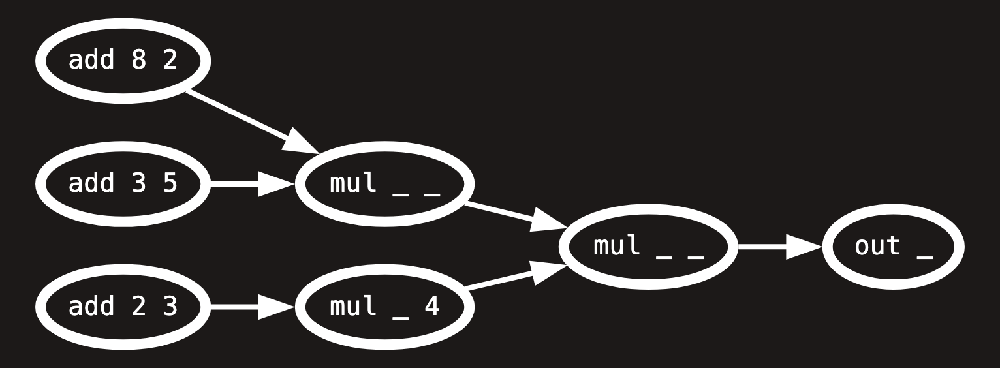

---
# You can also start simply with 'default'
theme: seriph
# random image from a curated Unsplash collection by Anthony
# like them? see https://unsplash.com/collections/94734566/slidev
# background: https://cover.sli.dev
# some information about your slides (markdown enabled)
title: tools for thought
info: |
  ## Slidev Starter Template
  Presentation slides for developers.

  Learn more at [Sli.dev](https://sli.dev)
# apply unocss classes to the current slide
class: text-center
# https://sli.dev/features/drawing
drawings:
  persist: false
# slide transition: https://sli.dev/guide/animations.html#slide-transitions
transition: fade
# enable MDC Syntax: https://sli.dev/features/mdc
mdc: true
# open graph
# seoMeta:
#  ogImage: https://cover.sli.dev
---

# Domain Specific Thoughts

## Top 3 Domain Specific Language Properties for 2025

---

# whoami

Felix Roos - @froos@post.lurk.org

- web developer by trade
- former trumpet player, now derailed
- got into live coding ~4 years ago
- made a few live coding languages
  - strudel
  - kabelsalat
  - mondo notation
- i do this just for fun, no strings attached

---

# tools for thought

and how i use them in my own languages

1. ## isomorphism
2. ## recursion
3. ## closure

---

# Disclaimer

I am not an academic! I am not an mathematician! I am not a computer scientist!
I am not an academic! I am not an mathematician! I am not a computer scientist!
I am not an academic! I am not an mathematician! I am not a computer scientist!
I am not an academic! I am not an mathematician! I am not a computer scientist!
I am not an academic! I am not an mathematician! I am not a computer scientist!
I am not an academic! I am not an mathematician! I am not a computer scientist!
I am not an academic! I am not an mathematician! I am not a computer scientist!
I am not an academic! I am not an mathematician! I am not a computer scientist!
I am not an academic! I am not an mathematician! I am not a computer scientist!
I am not an academic! I am not an mathematician! I am not a computer scientist!
I am not an academic! I am not an mathematician! I am not a computer scientist!
I am not an academic! I am not an mathematician! I am not a computer scientist!
I am not an academic! I am not an mathematician! I am not a computer scientist!
I am not an academic! I am not an mathematician! I am not a computer scientist!
I am not an academic! I am not an mathematician! I am not a computer scientist!
I am not an academic! I am not an mathematician! I am not a computer scientist!
I am not an academic! I am not an mathematician! I am not a computer scientist!
I am not an academic! I am not an mathematician! I am not a computer scientist!
I am not an academic! I am not an mathematician! I am not a computer scientist!
I am not an academic! I am not an mathematician! I am not a computer scientist!
I am not an academic! I am not an mathematician! I am not a computer scientist!
I am not an academic! I am not an mathematician! I am not a computer scientist!
I am not an academic! I am not an mathematician! I am not a computer scientist!
I am not an academic! I am not an mathematician! I am not a computer scientist!

---

# 1. isomorphism

The word "isomorphism' applies when two complex structures can be mapped onto
each other, in such a way that to each part of one structure there is a
corresponding part in the other structure, where "corresponding" means that the
two parts play similar roles in their respective structures.

_Chapter II in Gödel, Escher, Bach_

### isomorphism = information preserving transformation

<!--
The last comment block of each slide will be treated as slide notes. It will be visible and editable in Presenter Mode along with the slide. [Read more in the docs](https://sli.dev/guide/syntax.html#notes)
-->

---

# 1. isomorphism

bolero rhythm tree


<!--
Here is another comment.
-->

---

# 1. isomorphism

bolero as json

````md magic-move {lines: false}
```json
// multiple layers
[
  [
    [1, [1, 1, 1]],
    [1, [1, 1, 1]],
    [1, 1],
  ],
  [
    [1, [1, 1, 1]],
    [1, [1, 1, 1]],
    [[1, 1, 1], [1, 1, 1]],
  ],
];
```

```json
// more flat
[
  1,
  [1, 1, 1],
  1,
  [1, 1, 1],
  1,
  1,
  1,
  [1, 1, 1],
  1,
  [1, 1, 1],
  [1, 1, 1],
  [1, 1, 1]
]
```

```json
// very flat
[
  [1, 0, 0.75],
  [1, 0.75, 0.25],
  [1, 1, 0.25],
  [1, 1.25, 0.25],
  [1, 1.5, 0.75],
  [1, 2.25, 0.25],
  [1, 2.5, 0.25],
  [1, 2.75, 0.25],
  [1, 3, 0.75],
  [1, 3.75, 0.75],
  [1, 4.5, 0.75],
  [1, 5.25, 0.25],
  [1, 5.5, 0.25],
  [1, 5.75, 0.25],
  [1, 6, 0.75],
  [1, 6.75, 0.25],
  [1, 7, 0.25],
  [1, 7.25, 0.25],
  [1, 7.5, 0.25],
  [1, 7.75, 0.25],
  [1, 8, 0.25],
  [1, 8.25, 0.25],
  [1, 8.5, 0.25],
  [1, 8.75, 0.25]
]
```
````

---

# 1. isomorphism

bolero as strudel pattern

````md magic-move {lines: false}
```js
$: s("sd")
  .struct(`<
 [
  1 [1 1 1] 
  1 [1 1 1] 
  1 1
 ]
 [
  1 [1 1 1] 
  1 [1 1 1] 
  [1 1 1] [1 1 1]
 ]
>
`);
```

```js
$: s("sd")
  .struct(`<
 1 [1 1 1] 
 1 [1 1 1] 
 1 1
 1 [1 1 1] 
 1 [1 1 1] 
 [1 1 1] [1 1 1]
>*6
`);
```

```js
$: s("sd")
  .struct(`<
 [1 1*3]!2@3
 <1*2 1*6>@2
>*6
`);
```

```js
$: s("sd")
  .fast("<1 3 1 3 1 1 1 3 1 3 3 3>")
  .fast(4);
```

```js
$: s("sd*<1 3 1 3 1!3 3 1 3!3>")
  .fast(4);
```
````

[open in strudel](https://strudel.cc/#JDogcygic2QiKQogIC5zdHJ1Y3QoYDwKIFsKICAxIFsxIDEgMV0gCiAgMSBbMSAxIDFdIAogIDEgMQogXQogWwogIDEgWzEgMSAxXSAKICAxIFsxIDEgMV0gCiAgWzEgMSAxXSBbMSAxIDFdCiBdCj4KYCk%3D)

---

# 1. isomorphism

## what is lost in translation?

## what can be lost?

## what shouldn't?

**a very "isomorphic" language allows many ways to express one thing**

each representation changes your perspective

---

# 2. recursion

self-similarity


---

# 2. recursion

algebra example

````md magic-move {lines: false}
```plaintext
( (8+2) * (3+5) ) * ( (2+3) * 4 )
```

```plaintext
(* 
 (* 
  (+ 8 2) (+ 3 5)
 ) 
 (* 
  (+ 2 3) 
  4
 )
)
```
````



^ AST = Abstract Syntax Tree

---

# 2. recursion

recursive evaluation


---

# 2. recursion

hashpipe operator as syntax sugar over lisp / s-expressions

````md magic-move {lines: false}
```plaintext
110 # saw # lpf 300 # out
```

```plaintext
(out (lpf 300 (saw 110)))
```

```plaintext
impulse 4
# seq 110 220 330 440
# saw
# lpf (sine .1 # range .3 .8) .3
# out
```

```plaintext
(out 
 (lpf 
  (saw 
   (seq 
    (impulse 4) 110 220 330 440
   )
  ) 
  (range 
   (sine .1) .3 .8
  ) .3
 )
)
```
````

[go to garten](https://garten.salat.dev/kabelsalat/lispykabel.html#aW1wdWxzZSA0Cj4gc2VxIDExMCAyMjAgMzMwIDQ0MAo+IHNhdwo+IGxwZiAoc2luZSAuMSA+IHJhbmdlIC4zIC44KSAuMwo+IG91dA==)

---

# 2. recursion

staying close to the AST

- close to AST = recursion friendly = simpler to interpret
- deep nesting = unreadable / hard to type live
- s-expressions + syntax sugar
- **a recursive language allows inifinite nesting**

---

# 3. closure

an operation for combining data objects satisfies the closure property if the
results of combining things with that operation can themselves be combined using
the same operation. closure is the key to power in any means of combination
because it permits us to create hierarchical structures — structures made up of
parts, which themselves are made up of parts, and so on.

_Chapter 2.2 in Structure and Interpretation of Computer Programs_

**in a language that satisfies closure, you can apply any operation anywhere, as
often as you want**


---

# 3. closure

number systems example


---

# 3. closure

number systems example

|   | +   | *  | -  | /  | sqrt(+) | sqrt(-) |
| - | --- | -- | -- | -- | ------- | ------- |
| N | ✅  | ✅ | ❌ | ❌ | ❌      | ❌      |
| Z | ✅  | ✅ | ✅ | ❌ | ❌      | ❌      |
| Q | ✅  | ✅ | ✅ | ✅ | ❌      | ❌      |
| R |  ✅ | ✅ | ✅ | ✅ | ✅      | ❌      |
| C |  ✅ | ✅ | ✅ | ✅ | ✅      | ✅      |

- N is closed under addition, but not under subtraction
- Z is closed under subtraction, but not under division
- ...

---

# 3. closure

mondo notation example

```plaintext {1|2|3|4|5}
n [0 1 2 4] 
# scale <C:major F:minor>
# gain [.5 1]*2
# off .125 (# transpose 12)
# s [piano,sine]
# clip 1 # rel .2
# jux rev
```

[open in strudel](https://strudel.cc/#bW9uZG9gCm4gWzAgMSAyIDRdIAojIHNjYWxlIDxDOm1ham9yIEY6bWlub3I%2BCiMgZ2FpbiBbLjUgMV0qMgojIG9mZiAuMTI1ICgjIHRyYW5zcG9zZSAxMikKIyBzIFtwaWFubyxzaW5lXQojIGNsaXAgMSAjIHJlbCAuMgojIGp1eCByZXYKYA%3D%3D)

- **a language with closure encourages play**
- **combinatorial explosion: everything is connected to everything**
- **emerging complexity from simple parts**

---

# recap

## 1. isomorphism: different representations of the same

## 2. recursion: what can be nested?

## 3. closure: what can be combined?


---

